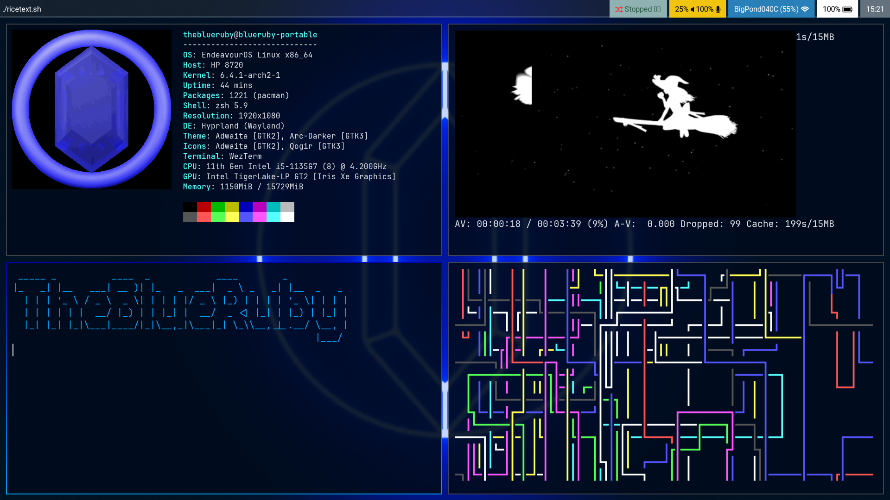

# Dotfiles

dotfiles 2 or something  
i use arch btw

## Dependencies

- hyprland (i use hyprland-hidpi-xprop-git)
- wofi
- wezterm
- thunar
- waybar
- most shells (copy aliases.sh into your rc file)

also includes configs for:  

- alacritty
- mopidy
    - Enables ncmpcpp visualization
- swaylock
    - Loads background from ~/Pictures/desktop-bg.png
- fuzzel

## Installation

The dotfiles repo directory will be represented as $REPO_DIR

1. Backup your .config folder, your .bashrc and .wezterm.lua
2. Install all dependencies above using your preferred package manager
3. clone or download this repo
4. symlink all folders except screenshots/ into your .config folder
    - `cd ~/.config`
    - for each folder do `ln -s $REPO_DIR/$FOLDER` where $FOLDER is the folder you are linking
5. copy .wezterm.lua into your home directory
6. copy aliases.sh into your shell rc file
    - Bash: `cat aliases.sh >> ~/.bashrc`
    - Zsh: `cat aliases.sh >> ~/.zshrc`
