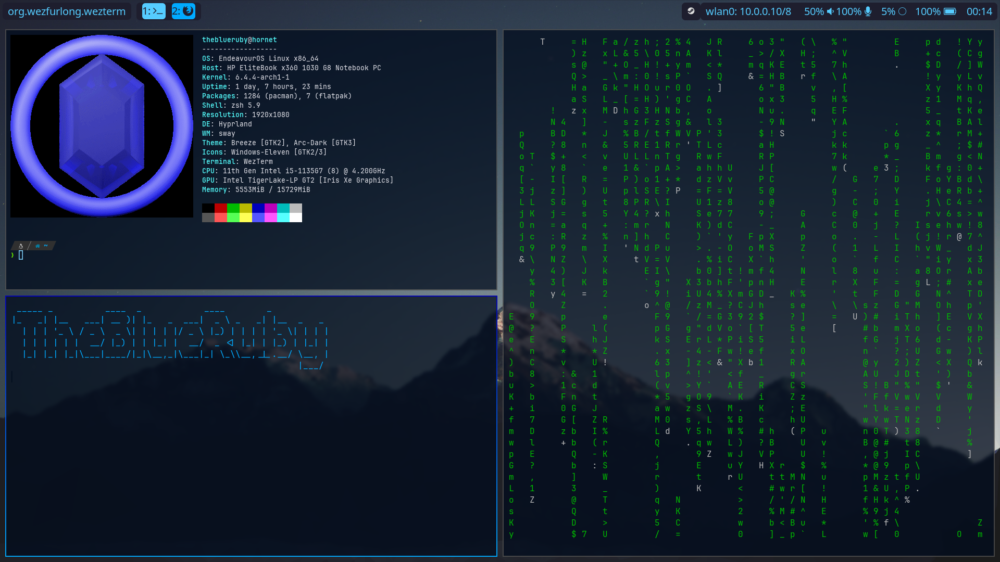

# Dotfiles

dotfiles 2 or something  
i use arch btw

## Dependencies

- hyprland (i use hyprland-hidpi-xprop-git)
- fuzzel
- wezterm
- thunar
- ironbar
    - `bc` needed for volume
- most shells (copy aliases.sh into your rc file)
- gtklock

also includes configs for:  

- alacritty
    - Enables ncmpcpp visualization
- swaylock
    - Loads background from ~/Pictures/desktop-bg.png
- waybar

## Installation

The dotfiles repo directory will be represented as $REPO_DIR

1. Backup your .config folder, your .bashrc and .wezterm.lua
2. Install all dependencies above using your preferred package manager
3. clone or download this repo
4. copy the contents of this .config folder into your home folder
    - cp -r $REPO_DIR/.config/* ~/.config
5. copy .wezterm.lua and screenshot.sh into your home directory
6. copy aliases.sh into your shell rc file (optional)
    - Bash: `cat aliases.sh >> ~/.bashrc`
    - Zsh: `cat aliases.sh >> ~/.zshrc`
