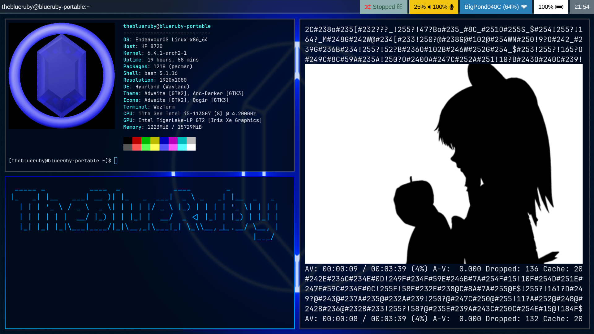

# Dotfiles

dotfiles 2 or something  
i use arch btw

## Dependencies

- hyprland (i use hyprland-hidpi-xprop-git)
- fuzzel
- wezterm
- thunar
- waybar
- bash (if using other shell copy file contents below the marker into your rc file)

also includes configs for:  

- alacritty
- mopidy
    - Enables ncmpcpp visualization
- swaylock
    - Loads background from ~/Pictures/desktop-bg.png

## Installation

The dotfiles repo directory will be represented as $REPO_DIR

1. Backup your .config folder, your .bashrc and .wezterm.lua
2. Install all dependencies above using your preferred package manager
3. clone or download this repo
4. symlink all folders except screenshots/ into your .config folder
    - `cd ~/.config`
    - for each folder do `ln -s $REPO_DIR/$FOLDER` where $FOLDER is the folder you are linking
5. copy .wezterm.lua and .bashrc into your home directory
